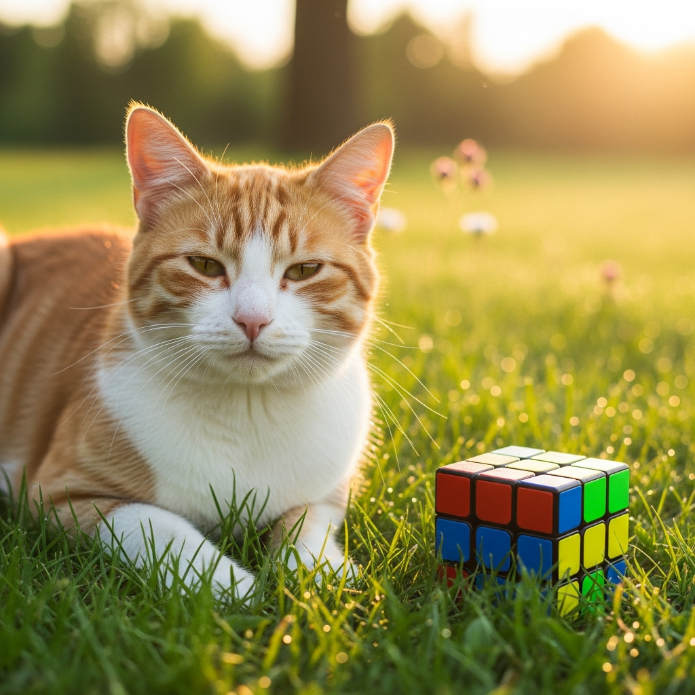

# rubiks_cube_mosaic
Mapping an image using a Rubiks cube standard colors.

# Sample
For the following original_image I used 100 cubes wide as the var input to atleast see some details from it.

## original

## mosaic - 100 cubes wide used

## Additional Info
PS: This code is a little fast because of downscaling the image first, reducing the dataset from millions of pixels to just the target grid size (e.g., 120x90). 

it uses NumPy vectorization to calculate the Euclidean distance for all 6 palette colors and 3 RGB channels simultaneously using (low-level C optimization) - the numpy lib, completely avoiding slow Python loops for the math operations.....

